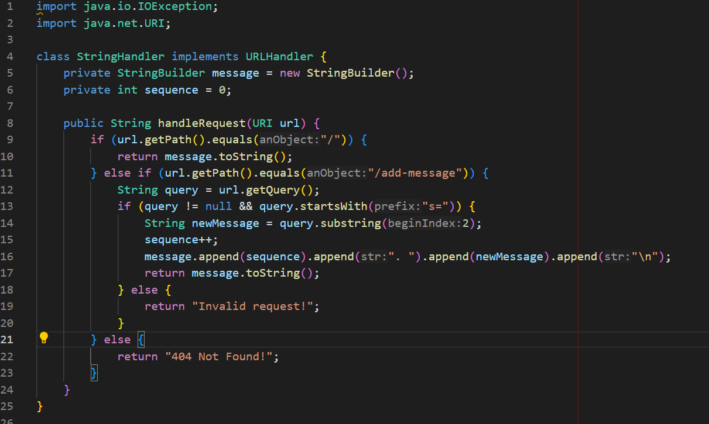
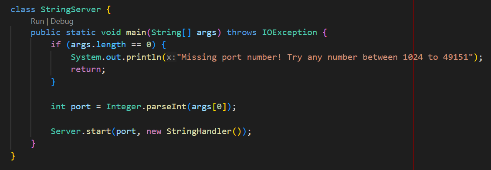
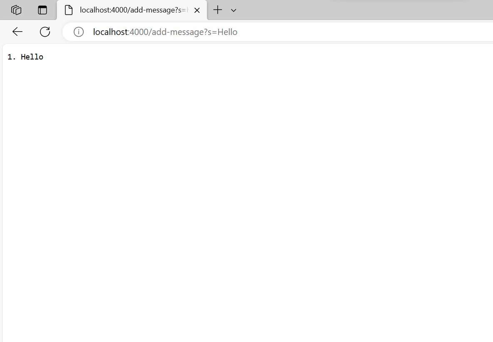
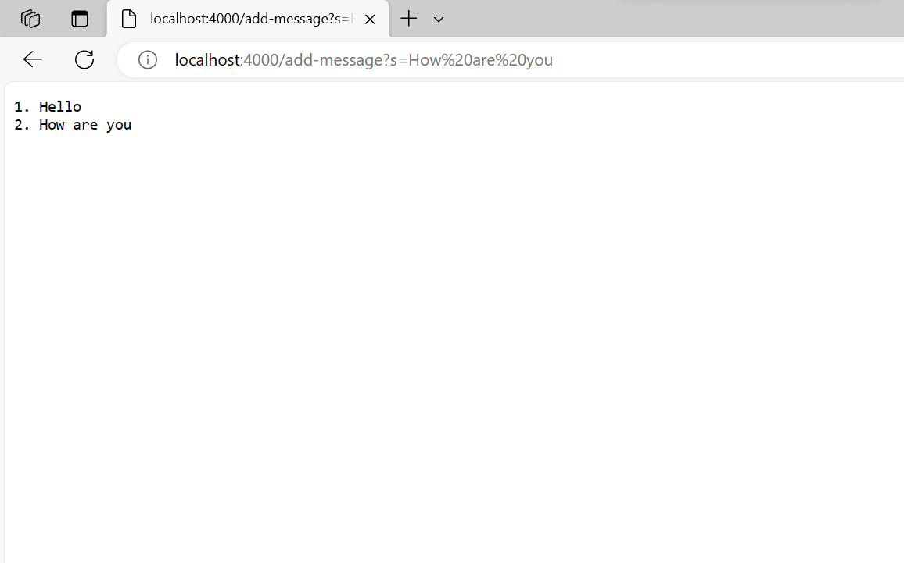
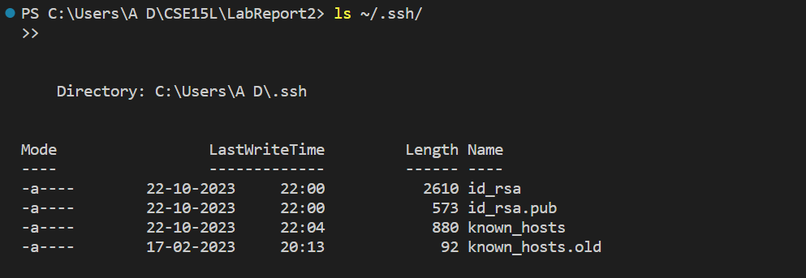
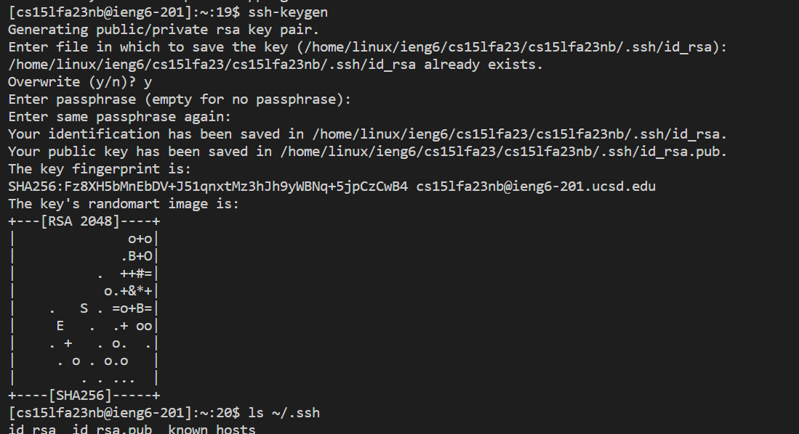
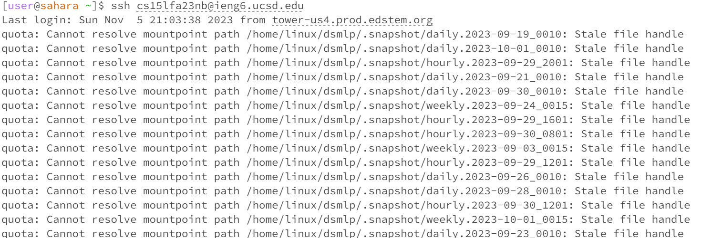
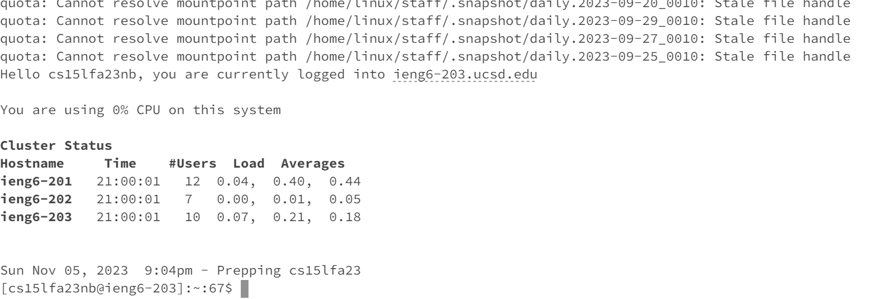

# Lab Report 2

In this lab, I created a web server called StringServer that supports the /add-message endpoint. The server is designed to keep track of a single string that gets extended with each incoming request. 
 

The expected behavior of this server is to concatenate a new line (\n), a sequentially increasing number (starting at 1), and the string provided after the = symbol to the running string. The server responds with the entire string constructed so far.

Below is a screenshot of the code for the file StringServer.java:

 
 

**Adding the first message**

Method Called: handleRequest(URI url) in the StringHandler class.

**Arguments:**

url - The URI object representing the URL of the request

**Relevant Fields and Values:**

message - A StringBuilder initialized as empty

sequence - An integer variable initialized as 0.

query - A string containing the query part of the URL, which is "s=Hello."

newMessage - A string containing the message extracted from the query, which is "Hello."

message (updated) - The StringBuilder is appended with "1. Hello\n" after processing the request.

**Change in Values:**

The sequence is incremented from 0 to 1, reflecting the first message.

The message is updated to "1. Hello\n," showing the message with the sequence number.

 

**Adding the second request**

**Method Called:**

handleRequest(URI url) in the StringHandler class.

**Arguments:**

url - The URI object representing the URL of the request

**Relevant Fields and Values:**

message - The StringBuilder containing the previous message "1. Hello\n."

sequence - An integer variable with the value 1, indicating the sequence number.

query - A string containing the query part of the URL, which is "s=How are you."

newMessage - A string containing the message extracted from the query, which is "How are you."

message (updated) - The StringBuilder is appended with "2. How are you\n" after processing the request.

**Change in Values:**

The sequence is incremented from 1 to 2, reflecting the second message.

The message is updated to "1. Hello\n2. How are you\n," showing both messages with their respective sequence numbers.

# Part 2

The private key file is id_rsa

 

The public key file is id_rsa.pub

Login to ieng6 without password

# Part 3
I gained a deeper understanding of web server development. Specifically, I learned how to create a simple web server using Java and handle HTTP requests, which is a fundamental skill for building web applications and services. This hands-on experience was a valuable addition to my knowledge of server-side programming.
